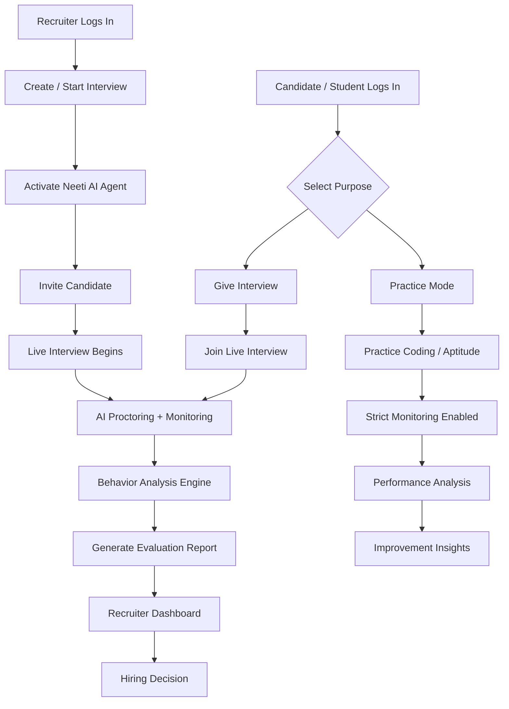

<div align="center">

# ⚖️ Neeti AI

### 🌐 *Reimagining Interview Integrity Through the Power of AI*

> _"Where every candidate gets a fair shot, and every recruiter gets the truth."_

<br/>


<br/>


</div>

---

## 📌 What is Neeti AI?

**Neeti AI** is a next-generation **intelligent recruitment integrity platform** built to eliminate the systemic failures crippling modern hiring pipelines.

By combining **AI-driven behavioral analysis**, **real-time monitoring**, and **structured assessment frameworks**, Neeti AI ensures every interview is:

> 🧭 **Fair** &nbsp;|&nbsp; 🔍 **Transparent** &nbsp;|&nbsp; 🎯 **Skill-Based**

---

## 📊 Project Presentation

> 🎥 Curious to see the bigger picture? Dive into our full project walkthrough:

<div align="center">

### 👉 [**View Presentation Slides**](https://docs.google.com/presentation/d/1bARKtIqIAkCCo1L6G9lMyexeYSVxOHqYAXPyOhATjkk/edit?usp=sharing)

</div>

---

## 🎯 The Problem We're Solving

The hiring world is broken. Here's why:


| ⚠️ Issue | 💥 Impact |
|---|---|
| 🕵️ Cheating during online interviews | Unqualified candidates slip through |
| 🧠 Lack of behavioral insights | Decisions made on gut feeling, not data |
| ⚖️ Biased or inconsistent evaluations | Great talent gets overlooked unfairly |
| 🎭 Fake candidates & proxy interviews | Company trust and resources wasted |
| 🌫️ Poor transparency in hiring decisions | Candidates left in the dark |

---

## 💡 The Neeti AI Solution

We didn't just patch the problem — we **rebuilt the system**. Neeti AI is an **end-to-end intelligent evaluation engine** that:

- 🤖 **Watches intelligently** — AI monitors every candidate interaction in real-time
- 🚨 **Flags instantly** — Suspicious activities are detected and flagged immediately
- 🗣️ **Listens deeply** — Confidence, speech patterns & engagement levels are analyzed
- 📋 **Reports objectively** — Structured, bias-free evaluation reports generated automatically
- 🤝 **Builds trust** — Creates a verifiable bridge of confidence between recruiters and candidates

---

## 🧠 Core Feature Suite

<table>
<tr>
<td width="50%">

### 🔍 Real-Time Proctoring Engine
> Your invisible, always-on exam guardian

- 👁️ Live face detection & multi-angle tracking
- 🖥️ Instant tab-switch & screen-leave detection
- 🔔 Automated suspicious activity alerts

</td>
<td width="50%">

### 🎙️ Behavioral Intelligence Module
> Reading between the lines of every response

- 🎵 Voice tone & confidence level analysis
- ⏱️ Response timing & hesitation evaluation
- 💬 Real-time engagement scoring

</td>
</tr>
<tr>
<td width="50%">

### 📊 Smart Evaluation Dashboard
> Turning raw data into actionable hiring decisions

- 🤖 AI-generated, structured candidate reports
- 📈 Deep performance insights & trend analysis
- 🧭 Decision-support tools for recruiters

</td>
<td width="50%">

### 🔐 Integrity Assurance Layer
> Because trust is the foundation of great hiring

- 🛡️ Multi-layered anti-cheating mechanisms
- 🪪 Robust identity verification system
- 🔒 End-to-end secure interview environment

</td>
</tr>
</table>

---

## 🏗️ System Architecture

```
┌─────────────────────────────────────────────────────────┐
│                       NEETI AI PLATFORM                 │
├──────────────┬──────────────┬──────────────┬────────────┤
│  🖥️ Frontend │ ⚙️ Backend  │ 🤖 AI Engine │🗄️ Database│
│  React UI    │  Next.js API │ Behavior     │ MongoDB    │
│  for Cands.  │  Auth &      │ Analysis     │ Candidate  │
│  & Recruitrs │  Processing  │ Monitor      │ Reports    │
└──────────────┴──────────────┴──────────────┴────────────┘
```

---

## 🔄 User Flow



---

## ⚙️ Tech Stack

<div align="center">

| Layer | Technology |
|---|---|
| 🎨 **Frontend** | React · Node.js · TypeScript · Tailwind CSS · GSAP · Three.js |
| 🔧 **Backend** | Express.js · Node.js |
| 🤖 **AI / ML** | Python |
| 🗄️ **Database** | MongoDB |
| 🌐 **API & Hosting** | 🚧 To be decided |

</div>

---

## 💼 Business Scope & Impact

Neeti AI is built to scale — from campus to corporation:

- 🏢 **Enterprise Hiring** — Seamless integration with companies for airtight, secure recruitment
- 🎓 **Campus Placements** — Empowering colleges with fair, standardized placement assessments
- 💻 **SaaS Platform** — A subscription-ready recruitment integrity solution for every scale
- 🌍 **Global Reach** — Architecture designed to support worldwide hiring ecosystems

---

## 🚀 What's Coming Next

The roadmap ahead is packed with innovation:

- 🧬 **Advanced Emotion Detection** — Going beyond words to understand how candidates truly feel
- 🤖 **AI-Based Question Generation** — Dynamic, adaptive questions tailored per candidate profile
- 🔗 **Job Portal Integration** — Plug directly into LinkedIn, Naukri, and more
- 🌏 **Multi-Language Support** — Breaking language barriers in global hiring
- 📡 **Real-Time Recruiter Alerts** — Instant push notifications for critical interview events

---

## 🤝 The Team Behind Neeti AI

| 👤 Name | 🛠️ Role |
|---|---|
| **Subh** | 🎨 UI/UX Design · Frontend Engineering · Database |
| **Sukrit** | 🤖 AI / ML Development |
| **Soumaya** | 🤖 AI / ML Development · API Integration |
| **Sayan** | ⚙️ Backend Development |

---

## 💬 Our Mission

> *Neeti AI is not just a tool — it's a movement toward **fair, transparent, and intelligent hiring**.*
>
> In a world full of noise, we let **merit speak the loudest**.
>
> 🌟 *Redefining how talent is discovered and evaluated in the digital era.*

---

<div align="center">

**Made with ❤️ for a fairer world of work**

</div>

